# Student Depression Risk Analysis and Recommendations

An exploratory and predictive analysis of student depression risk factors, designed to translate statistical findings into practical screening and student-support recommendations.

> This project is an educational data analysis, not a clinical diagnostic tool. Any real-world screening process should be reviewed by qualified mental-health professionals and must include appropriate consent, privacy, and escalation procedures.

## Project objective

The project examines how academic pressure, financial stress, study satisfaction, lifestyle factors, and self-reported suicidal thoughts are associated with depression in a student sample. It combines exploratory analysis with logistic regression to identify high-signal factors and propose preventive actions for universities and student-wellness teams.

## Dataset

The dataset contains 502 student records, 10 predictor variables, and one binary target.

| Item | Value |
|---|---:|
| Records | 502 |
| Predictors | 10 |
| Missing values | 0 |
| Duplicate rows | 0 |
| Depression = Yes | 252 |
| Depression = No | 250 |

Predictors include age, gender, academic pressure, study satisfaction, sleep duration, dietary habits, study hours, financial stress, family mental-health history, and prior suicidal thoughts.

## Methodology

1. Audited data types, missing values, duplicates, and class balance.
2. Encoded the binary target and categorical predictors.
3. Used an 80/20 stratified train-test split with a fixed random seed.
4. Screened individual predictors with simple logistic-regression models.
5. Combined statistically significant predictors in a multiple logistic-regression model.
6. Evaluated the final model using a confusion matrix, precision, recall, F1-score, ROC curve, and AUC.
7. Converted the results into recommendations for early screening and student support.

## Results

The final test set contained 101 students. The model correctly classified 97 records.

| Metric | Result |
|---|---:|
| Accuracy | 0.96 |
| Precision, depression class | 0.96 |
| Recall, depression class | 0.96 |
| F1-score, depression class | 0.96 |
| ROC AUC | 0.995 |

Confusion matrix: 48 true negatives, 2 false positives, 2 false negatives, and 49 true positives.

The strongest positive associations in the fitted model were prior suicidal thoughts, academic pressure, financial stress, and unhealthy dietary habits. Higher study satisfaction and older age were associated with lower predicted risk in this sample.

## Visualizations

### Dataset balance

The target is almost perfectly balanced, with 252 students in the depression class and 250 students in the non-depression class.

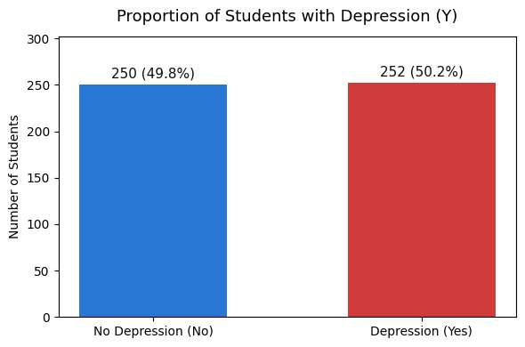

The stratified split preserves this balance in both the training and test sets.

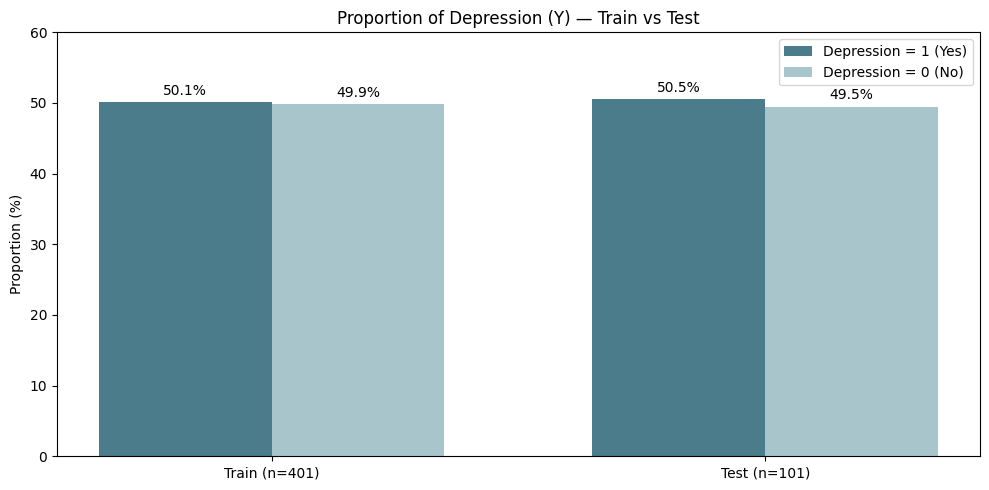

### Exploratory analysis

The categorical overview shows the sample composition for gender, sleep duration, dietary habits, suicidal thoughts, and family mental-health history.

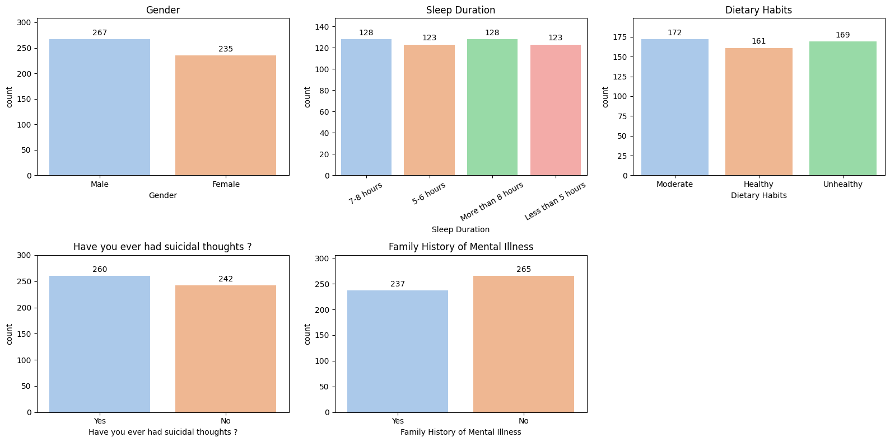

Students in the depression class show higher academic pressure, financial stress, and study hours, together with lower study satisfaction in this sample.

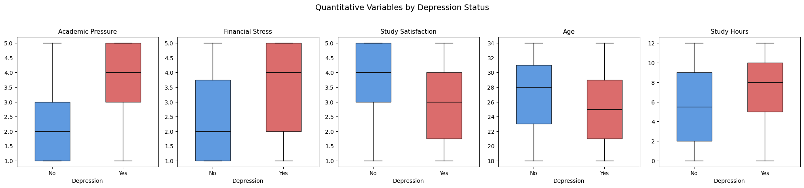

### Presentation insights: controllable and daily-life factors

Page 15 of the project presentation compares depression-status counts across academic-pressure and financial-stress levels. The depressed group becomes more prominent at the higher levels of both factors, supporting their inclusion in student screening and support planning.

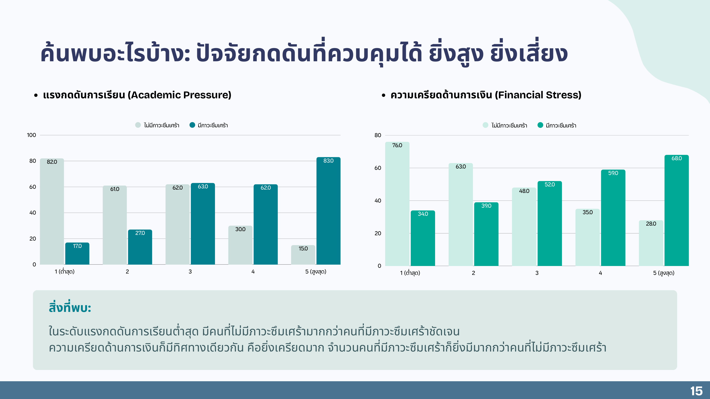

Page 16 compares study satisfaction and dietary habits. Lower study satisfaction and unhealthy dietary habits show a visibly larger depressed group in this sample, while these descriptive counts should not be interpreted as causal effects.

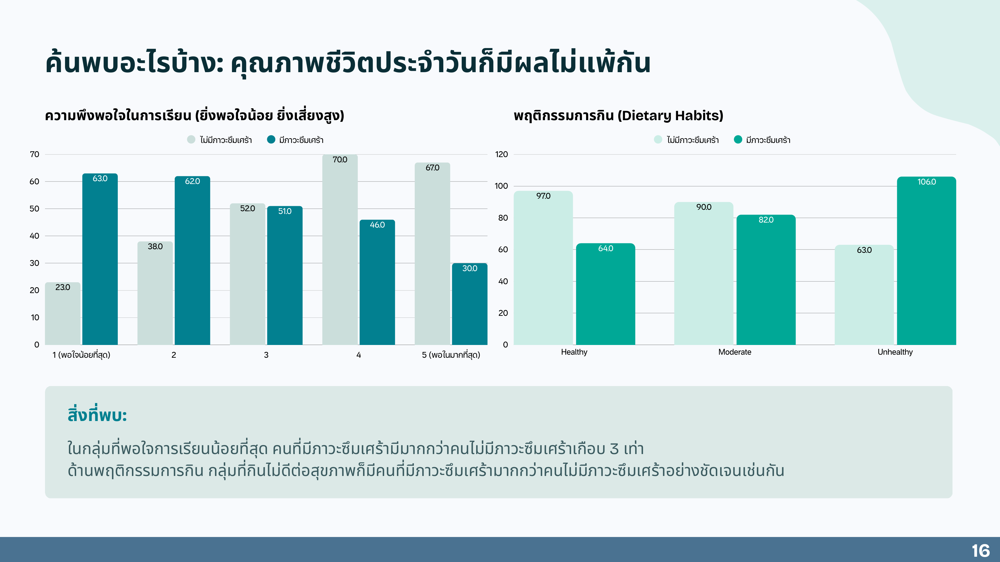

The normalized categorical comparison highlights the largest separation for prior suicidal thoughts and unhealthy dietary habits.

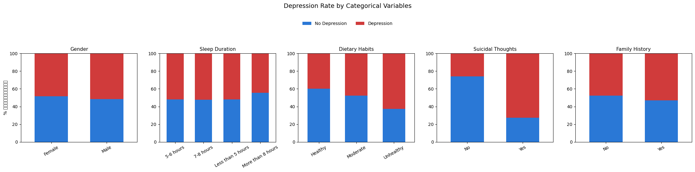

### Model interpretation and performance

The simple logistic-regression screening identifies the predictors below the 0.05 significance threshold.

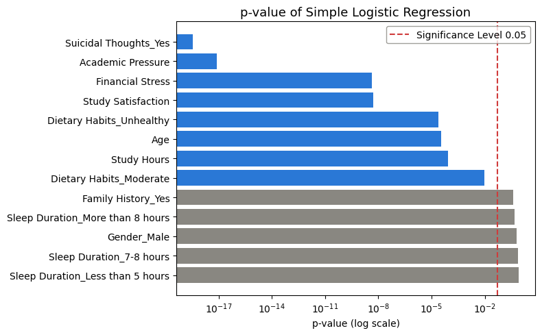

Positive coefficients increase the fitted log-odds of depression, while negative coefficients reduce them. Prior suicidal thoughts have the largest positive coefficient, but this estimate should be interpreted cautiously because the notebook reports possible quasi-separation.

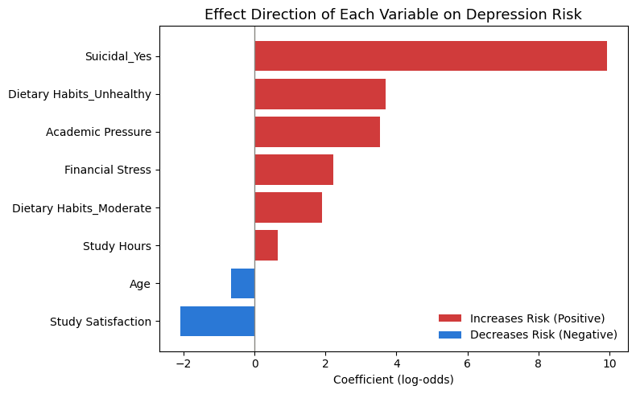

The held-out test confusion matrix contains 48 true negatives, 49 true positives, 2 false positives, and 2 false negatives.

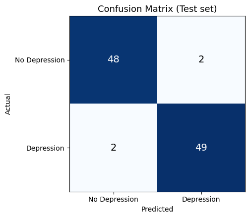

The ROC curve reports an AUC of 0.995 on the held-out test set.

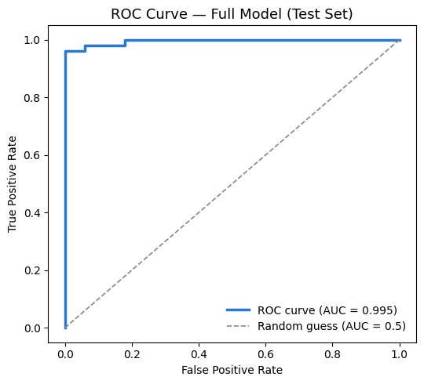

## Interpretation and recommendations

- Prioritize a short, voluntary screening workflow around academic pressure, financial stress, study satisfaction, and urgent safety questions.
- Treat any disclosure of suicidal thoughts as a direct support and escalation signal rather than merely a predictive feature.
- Combine risk scoring with trained human review. Do not use the score to deny services, impose discipline, or make high-stakes decisions automatically.
- Offer academic-workload support, financial counseling, accessible mental-health services, and clear referral pathways.
- Monitor recall and false negatives because missed at-risk students are more consequential than a modest number of additional reviews.

## Important limitations

- The sample is small and may not represent other universities, countries, or age groups.
- The analysis identifies associations, not causal effects.
- The fitted model shows possible quasi-separation, especially around the suicidal-thoughts variable. Coefficient magnitude and odds ratios may therefore be unstable.
- Variable selection was performed on the training set using univariate p-values. Cross-validation and external validation are needed before deployment.
- Dataset provenance and licensing should be confirmed before public redistribution.

## Repository contents

```text
.
├── Depression Student Dataset.csv
├── Depression_Student_Logistic_Regression.ipynb
├── Project Regression.pdf
├── images/
│   ├── 01_train_test_class_balance.png
│   ├── 02_categorical_distributions.png
│   ├── 03_confusion_matrix.png
│   ├── 04_depression_distribution.png
│   ├── 05_quantitative_factors.png
│   ├── 06_categorical_factors.png
│   ├── 07_predictor_significance.png
│   ├── 08_model_coefficients.png
│   ├── 09_roc_curve.png
│   ├── 10_controllable_risk_factors.png
│   └── 11_daily_life_factors.png
└── README.md
```

## How to run

```bash
pip install pandas numpy matplotlib seaborn scikit-learn statsmodels
jupyter notebook Depression_Student_Logistic_Regression.ipynb
```

Run the notebook from top to bottom so that preprocessing, feature selection, prediction, and evaluation use the same train-test split.

## Tools

Python, pandas, NumPy, Matplotlib, Seaborn, scikit-learn, statsmodels, and Jupyter Notebook.

## Future improvements

- Replace one-time evaluation with repeated stratified cross-validation.
- Compare regularized logistic regression with tree-based baselines.
- Add probability calibration and threshold selection based on the cost of false negatives.
- Validate on an independent dataset and assess performance across demographic groups.
- Develop a privacy-preserving prototype that routes high-risk responses directly to qualified support staff.
